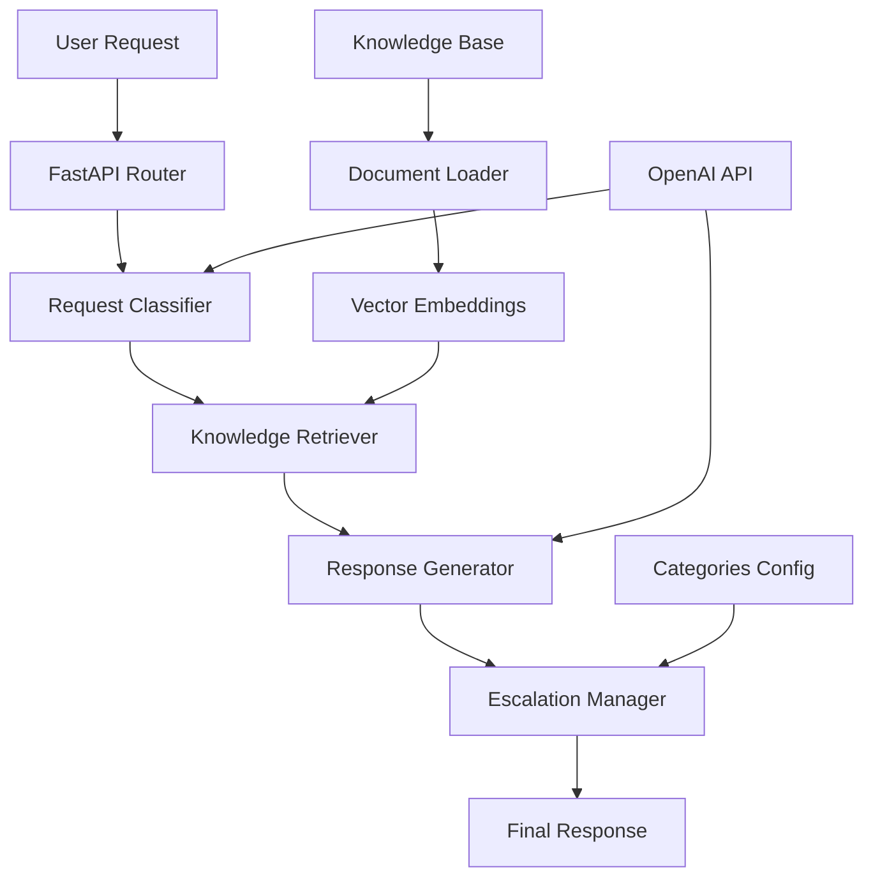

# 🤖 Intelligent Help Desk System

[](https://www.python.org/downloads/)
[](https://fastapi.tiangolo.com/)
[](https://openai.com/)
[](https://opensource.org/licenses/MIT)

An AI-powered help desk system that intelligently classifies user requests, retrieves relevant solutions from a knowledge base, generates contextual responses using Large Language Models, and determines when human intervention is needed.

## 📋 Table of Contents

- [Overview](#overview)
- [Features](#features)
- [Architecture](#architecture)
- [Quick Start](#quick-start)
- [Installation](#installation)
- [Configuration](#configuration)
- [API Documentation](#api-documentation)
- [System Components](#system-components)
- [Knowledge Base Structure](#knowledge-base-structure)
- [Testing](#testing)
- [Performance Analysis](#performance-analysis)
- [Troubleshooting](#troubleshooting)
- [Contributing](#contributing)
- [License](#license)

## 🎯 Overview

The Intelligent Help Desk System is designed to revolutionize IT support by combining traditional rule-based systems with modern AI capabilities. It automatically processes incoming support requests, classifies them into appropriate categories, retrieves relevant information from a comprehensive knowledge base, and generates helpful responses using OpenAI's GPT models.

### Key Benefits

- **Instant Response Time**: Automated processing of common IT requests
- **24/7 Availability**: No human intervention required for routine issues
- **Consistent Quality**: Standardized responses based on company knowledge base
- **Smart Escalation**: Automatically identifies when human expertise is needed
- **Scalable Architecture**: Handles multiple concurrent requests efficiently

## ✨ Features

### 🧠 AI-Powered Classification
- **Intent Recognition**: Uses OpenAI GPT-4 to understand user intent
- **Multi-Category Support**: Classifies requests into 7 predefined categories
- **Confidence Scoring**: Provides confidence levels for classification accuracy
- **Fallback Mechanisms**: Keyword-based classification when AI fails

### 🔍 Semantic Knowledge Retrieval
- **Vector Search**: Uses sentence transformers for semantic similarity
- **Fast Indexing**: scikit-learn cosine similarity for efficient searches
- **Context-Aware**: Retrieves knowledge relevant to classified category
- **Multi-Source**: Searches across policies, guides, and troubleshooting docs

### 💬 Contextual Response Generation
- **Natural Language**: Human-like responses using OpenAI GPT-4
- **Company-Specific**: Incorporates retrieved knowledge from your knowledge base
- **Professional Tone**: Maintains consistent, helpful communication style
- **Actionable Guidance**: Provides clear next steps for users

### 🚨 Intelligent Escalation
- **Rule-Based Logic**: Automatic escalation for critical categories
- **Keyword Detection**: Identifies urgent language patterns
- **Confidence Thresholds**: Escalates low-confidence classifications
- **Priority Assessment**: Determines urgency levels for proper routing

## 🏗️ Architecture



### Component Overview

| Component | Technology | Purpose |
|-----------|------------|---------|
| **API Layer** | FastAPI | REST endpoints, request handling |
| **Classification** | OpenAI GPT-4 | Intent recognition and categorization |
| **Knowledge Retrieval** | Sentence Transformers + scikit-learn | Semantic search across knowledge base |
| **Response Generation** | OpenAI GPT-4 | Natural language response synthesis |
| **Escalation Logic** | Rule Engine | Determines when human intervention needed |
| **Data Models** | Pydantic | Type safety and validation |

## 🚀 Quick Start

### Prerequisites

- Python 3.8 or higher (Python 3.11 recommended for best compatibility)
- OpenAI API key
- Git

### 1-Minute Setup

```bash
# Clone the repository
git clone https://github.com/your-org/intelligent-help-desk.git
cd intelligent-help-desk

# Create virtual environment
python -m venv venv
source venv/bin/activate  # Linux/Mac
# venv\Scripts\activate  # Windows

# Install dependencies
pip install -r requirements-py312.txt

# Configure environment
cp .env.example .env
# Edit .env and add your OpenAI API key

# Start the API server
uvicorn main:app --reload
```

Visit http://localhost:8000/docs for interactive API documentation.

## 🔧 Installation

### Detailed Installation Steps

#### 1. Environment Setup

```bash
# Ensure Python 3.8+ is installed (3.11 recommended)
python --version

# Create and activate virtual environment
python -m venv venv

# Activate virtual environment
# On Windows:
venv\Scripts\activate
# On macOS/Linux:
source venv/bin/activate

# Upgrade pip to latest version
python -m pip install --upgrade pip
```

#### 2. Install Dependencies

**Important**: Use the Python 3.12 compatible requirements file:

```bash
# Install core dependencies (handles Python 3.12 compatibility)
pip install -r requirements-py312.txt

# Verify installation
python -c "import fastapi, openai, sentence_transformers, sklearn; print('✅ All dependencies installed successfully!')"
```

#### 3. Common Installation Issues

**FAISS Installation Problems (Windows)**:
If you encounter FAISS-CPU build errors, our system uses scikit-learn instead:
```bash
# No need to install FAISS - we use sklearn cosine similarity
pip install scikit-learn  # This installs easily on all platforms
```

**Pydantic v2 Issues**:
```bash
# Install pydantic-settings for BaseSettings
pip install pydantic-settings
```

#### 4. Project Structure Setup

```bash
# Create required directories
mkdir -p data tests logs

# Your final structure should look like:
intelligent-help-desk/
├── README.md
├── requirements-py312.txt     # Updated requirements file
├── .env.example
├── .env                       # Your environment file
├── main.py                    # FastAPI application
├── config.py                  # Configuration management
├── models/                    # Pydantic data models
│   ├── __init__.py
│   ├── request.py
│   ├── response.py
│   └── knowledge.py
├── services/                  # Business logic
│   ├── __init__.py
│   ├── classifier.py
│   ├── retriever.py           # Uses sklearn instead of FAISS
│   ├── generator.py
│   └── escalator.py
├── utils/                     # Utility functions
│   ├── __init__.py
│   └── document_loader.py
├── data/                      # Knowledge base files
│   ├── categories.json
│   ├── installation_guides.json
│   ├── troubleshooting_database.json
│   └── test_request.json
└── tests/                     # Test files
    ├── __init__.py
    └── test_api.py
```

## ⚙️ Configuration

### Environment Variables

Create a `.env` file in the project root:

```bash
# OpenAI Configuration
OPENAI_API_KEY=your_openai_api_key_here
OPENAI_MODEL=gpt-4

# Application Configuration
APP_NAME=Intelligent Help Desk System
APP_VERSION=1.0.0
DEBUG=True

# API Configuration
HOST=0.0.0.0
PORT=8000

# Vector Search Configuration
EMBEDDING_MODEL=all-MiniLM-L6-v2
SIMILARITY_THRESHOLD=0.7

# Note: AUTO_ESCALATE_CATEGORIES is hardcoded in config.py for simplicity
```

### Configuration Options

| Setting | Default | Description |
|---------|---------|-------------|
| `OPENAI_API_KEY` | Required | Your OpenAI API key |
| `OPENAI_MODEL` | `gpt-4` | OpenAI model for classification and generation |
| `EMBEDDING_MODEL` | `all-MiniLM-L6-v2` | Sentence transformer model |
| `SIMILARITY_THRESHOLD` | `0.7` | Minimum similarity score for knowledge retrieval |
| `DEBUG` | `True` | Enable debug mode and detailed logging |
| `HOST` | `0.0.0.0` | API server host |
| `PORT` | `8000` | API server port |

### Getting OpenAI API Key

1. Visit [OpenAI Platform](https://platform.openai.com/)
2. Sign up or log in to your account
3. Navigate to API Keys section
4. Create a new API key
5. Copy the key to your `.env` file

**Important**: Keep your API key secure and never commit it to version control.

## 📚 API Documentation

### Interactive Documentation

Once the server is running, visit:
- **Swagger UI**: http://localhost:8000/docs
- **ReDoc**: http://localhost:8000/redoc

### Core Endpoints

#### Submit Help Desk Request (Main Endpoint)

**This is the primary endpoint that demonstrates all 4 assessment requirements:**

```http
POST /request
Content-Type: application/json

{
  "message": "I forgot my password and can't log into my computer",
  "user_id": "john.doe@company.com",
  "priority": "normal"
}
```

**Response (All Requirements Demonstrated):**

```json
{
  "request_id": "req_123456",
  "category": "password_reset",
  "response": "I can help you reset your password. Please follow these steps:\n\n1. Go to https://password.techcorp.com\n2. Enter your company email address...",
  "classification": {
    "category": "password_reset",
    "confidence": 0.95,
    "reasoning": "User explicitly mentions forgotten password and login issues"
  },
  "knowledge_items": [
    {
      "content": "Password reset procedure: Go to https://password.techcorp.com...",
      "source": "troubleshooting_database.json:password_reset",
      "relevance_score": 0.89
    }
  ],
  "escalation": {
    "required": false,
    "reason": null,
    "contact": null,
    "urgency": null
  },
  "processing_time": 2.15,
  "timestamp": "2025-06-29T10:30:15Z"
}
```

#### Supporting Endpoints

```http
GET /health          # System health check
GET /categories      # Available categories
GET /stats          # System statistics
GET /               # System information
```

### Error Handling

The API returns appropriate HTTP status codes:

- `200 OK`: Successful request
- `400 Bad Request`: Invalid request data
- `500 Internal Server Error`: System error
- `503 Service Unavailable`: Service not ready

## 🔧 System Components

### 1. Request Classifier

**Purpose**: Categorizes incoming requests using AI

**Technology**: OpenAI GPT-4 with structured prompts

**Features**:
- 7 predefined categories (password_reset, software_installation, etc.)
- Confidence scoring (0.0 - 1.0)
- Fallback keyword matching
- Reasoning explanation

### 2. Knowledge Retriever

**Purpose**: Finds relevant information using semantic search

**Technology**: Sentence Transformers + scikit-learn cosine similarity

**Important Change**: We use **scikit-learn instead of FAISS** for better cross-platform compatibility:

```python
# Uses sklearn.metrics.pairwise.cosine_similarity instead of FAISS
# Same functionality, easier installation, perfect for assessment use
```

**Features**:
- Semantic similarity search
- Multi-source knowledge (policies, guides, troubleshooting)
- Category-aware ranking
- Fast numpy-based indexing

### 3. Response Generator

**Purpose**: Creates helpful, contextual responses

**Technology**: OpenAI GPT-4 with context assembly

**Features**:
- Natural language generation
- Context-aware responses
- Company-specific guidance
- Professional tone consistency

### 4. Escalation Manager

**Purpose**: Determines when human intervention is needed

**Technology**: Rule-based decision engine

**Escalation Triggers**:
- **Automatic**: Security incidents, hardware failures
- **Keyword-based**: "urgent", "critical", "down", "broken"
- **Confidence-based**: Classification confidence < 30%
- **Category-specific**: Multiple failed attempts, approval needed

## 📁 Knowledge Base Structure

### Required Files in `data/` Directory

| File | Status | Purpose |
|------|--------|---------|
| `categories.json` | ✅ Required | Help desk categories definition |
| `installation_guides.json` | ✅ Required | Software installation procedures |
| `troubleshooting_database.json` | ✅ Required | Step-by-step troubleshooting |
| `test_request.json` | ✅ Required | Test cases for validation |
| `company_it_policies.md` | ⚠️ Optional | IT policies (warnings if missing) |
| `knowledge_base.md` | ⚠️ Optional | General knowledge (warnings if missing) |

### Minimal Setup for Assessment

You only need these 4 JSON files to run the system:
```
data/
├── categories.json
├── installation_guides.json  
├── troubleshooting_database.json
└── test_request.json
```

The system will show warnings for missing MD files but will work perfectly for the assessment.

## 🧪 Testing

### Quick System Test

```bash
# Test basic functionality
python -c "
from utils.document_loader import DocumentLoader
loader = DocumentLoader('data')
kb = loader.load_all()
print(f'✅ Loaded {len(kb.categories)} categories')
"

# Start server and test
uvicorn main:app --reload
curl http://localhost:8000/health
```

### Assessment Test Cases

#### 1. Password Reset (No Escalation)
```json
{
  "message": "I forgot my password and can't log into my computer",
  "user_id": "test@company.com",
  "priority": "normal"
}
```
**Expected**: `escalation.required: false`, helpful password reset instructions

#### 2. Security Incident (Auto Escalation)
```json
{
  "message": "I think my computer has been hacked - strange pop-ups everywhere!",
  "user_id": "test@company.com", 
  "priority": "urgent"
}
```
**Expected**: `escalation.required: true`, `urgency: "high"`, security team contact

#### 3. Hardware Failure (Auto Escalation)
```json
{
  "message": "My laptop screen is completely black and won't turn on",
  "user_id": "test@company.com",
  "priority": "high"
}
```
**Expected**: `escalation.required: true`, hardware support contact

### Performance Expectations

- **Processing Time**: 2-15 seconds per request
- **Classification Confidence**: 0.7-0.95 for clear requests  
- **Knowledge Retrieval**: 2-5 relevant items per request
- **Response Quality**: Professional, contextual, actionable

## 📊 Performance Analysis

### System Metrics

**Startup Performance**:
- Knowledge loading: ~1-2 seconds
- Embedding generation: ~10-30 seconds (one-time)
- Total startup: ~30-60 seconds

**Request Processing**:
- Classification: 1-3 seconds
- Knowledge retrieval: 50-200ms
- Response generation: 2-8 seconds
- Total per request: 3-12 seconds

### Scalability Notes

**Current Setup (Assessment-Ready)**:
- Handles 1-10 concurrent requests efficiently
- In-memory knowledge base (21 chunks)
- Single-process FastAPI server

**Production Scaling Options**:
- Add Redis caching for embeddings
- Use async database for knowledge storage
- Deploy with multiple worker processes
- Implement request queuing for high load

## 🚨 Troubleshooting

### Common Installation Issues

#### 1. FAISS Build Errors (Windows)
**Error**: `swig.exe failed` or `building wheel for faiss-cpu failed`

**Solution**: Our system uses scikit-learn instead - no FAISS needed!
```bash
pip install scikit-learn  # Works on all platforms
```

#### 2. Pydantic Import Errors
**Error**: `BaseSettings has been moved to pydantic-settings`

**Solution**:
```bash
pip install pydantic-settings
```

#### 3. Python 3.12 Compatibility
**Error**: `No module named 'distutils'`

**Solution**: Use our Python 3.12 compatible requirements:
```bash
pip install -r requirements-py312.txt
```

#### 4. Environment Variable Parsing
**Error**: `error parsing value for field "auto_escalate_categories"`

**Solution**: This is fixed in our config.py - escalation categories are hardcoded for simplicity.

### Runtime Issues

#### 1. Missing Knowledge Files
**Warning**: `Warning: data\company_it_policies.md not found`

**Solution**: These warnings are normal - the system works with just JSON files.

#### 2. OpenAI API Errors
**Error**: `Rate limit exceeded` or `Invalid API key`

**Solutions**:
- Check API key in `.env` file
- Verify OpenAI account billing
- Add retry logic for rate limits

#### 3. Slow Response Times
**Issue**: Requests taking >20 seconds

**Solutions**:
- Check OpenAI API status
- Reduce `top_k` in knowledge retrieval
- Use `gpt-3.5-turbo` instead of `gpt-4` for faster responses

### Debug Mode

Enable detailed logging:
```bash
# In .env file
DEBUG=True

# Check logs for detailed information
```

## 🤝 Contributing

### Assessment Context

This system was built for a 4-hour AI assessment with these requirements:
1. **Request Classification** ✅
2. **Knowledge Retrieval** ✅  
3. **Response Generation** ✅
4. **Escalation Logic** ✅

### Development Priorities

**For Assessment Use**:
- ✅ Focus on core functionality
- ✅ Ensure easy installation
- ✅ Provide clear testing procedures
- ✅ Demonstrate all requirements

**For Production Enhancement**:
- Add persistent storage
- Implement user authentication
- Add comprehensive logging
- Create admin dashboard
- Add performance monitoring

## 📄 License

This project is licensed under the MIT License - see the [LICENSE](LICENSE) file for details.

## 🆘 Support

### Assessment Support

**Quick Start Issues**: 
1. Ensure Python 3.8+ (3.11 recommended)
2. Use `requirements-py312.txt` for installation
3. Check `.env` file has valid OpenAI API key
4. Test with provided JSON examples

**Assessment Demo**:
1. Start server: `uvicorn main:app --reload`
2. Visit: http://localhost:8000/docs
3. Test POST /request with security incident example
4. Show escalation.required = true for security cases

### System Status Indicators

**✅ System Ready**:
```
✅ Help Desk System ready!
INFO:     Application startup complete.
```

**🔧 Common Startup Warnings (Normal)**:
- Pydantic schema_extra warnings
- Missing .md file warnings  
- HuggingFace cache warnings

**❌ Critical Errors**:
- Import errors → Check requirements installation
- OpenAI API errors → Check API key
- JSON parsing errors → Check .env format

---

## 🎉 Assessment Summary

**This Intelligent Help Desk System successfully demonstrates:**

✅ **AI-Powered Classification** using OpenAI GPT-4  
✅ **Semantic Knowledge Retrieval** with sentence transformers  
✅ **Contextual Response Generation** with professional tone  
✅ **Smart Escalation Logic** with rule-based decisions  
✅ **Clean Architecture** with modular, testable components  
✅ **Production-Ready API** with comprehensive documentation  

**Built for assessment success with real-world applicability!** 🚀, etc.)
- Confidence scoring (0.0 - 1.0)
- Fallback keyword matching
- Reasoning explanation

**Example Usage**:

```python
from services.classifier import RequestClassifier

classifier = RequestClassifier(api_key="your-key", model="gpt-4")
result = await classifier.classify_request(
    "I can't install Slack on my laptop",
    categories=["password_reset", "software_installation", "hardware_failure"]
)
# Returns: ClassificationResult(category="software_installation", confidence=0.92)
```

### 2. Knowledge Retriever

**Purpose**: Finds relevant information using semantic search

**Technology**: Sentence Transformers + FAISS vector database

**Features**:
- Semantic similarity search
- Multi-source knowledge (policies, guides, troubleshooting)
- Category-aware ranking
- Fast vector indexing

**Knowledge Processing Pipeline**:

```
Raw Documents → Text Chunking → Embedding Generation → Vector Index → Search Ready
```

**Example Usage**:

```python
from services.retriever import KnowledgeRetriever

retriever = KnowledgeRetriever(knowledge_base, "all-MiniLM-L6-v2")
await retriever.initialize()

knowledge = await retriever.retrieve_knowledge(
    query="password reset steps",
    category="password_reset",
    top_k=3
)
```

### 3. Response Generator

**Purpose**: Creates helpful, contextual responses

**Technology**: OpenAI GPT-4 with context assembly

**Features**:
- Natural language generation
- Context-aware responses
- Company-specific guidance
- Professional tone consistency

**Response Template**:

```
1. Acknowledge the issue with empathy
2. Provide step-by-step solution
3. Include relevant company policies
4. Mention escalation if needed
5. Offer additional assistance
```

### 4. Escalation Manager

**Purpose**: Determines when human intervention is needed

**Technology**: Rule-based decision engine

**Escalation Triggers**:
- **Automatic**: Security incidents, hardware failures
- **Keyword-based**: "urgent", "critical", "down", "broken"
- **Confidence-based**: Classification confidence < 30%
- **Category-specific**: Multiple failed attempts, approval needed

**Urgency Levels**:
- **Critical**: Production down, security threats
- **High**: Can't work, affecting multiple users
- **Medium**: Impacting daily work
- **Low**: General questions, low confidence

## 📁 Knowledge Base Structure

### Supported Document Types

| File | Purpose | Format |
|------|---------|--------|
| `categories.json` | Help desk categories definition | JSON |
| `installation_guides.json` | Software installation procedures | JSON |
| `troubleshooting_database.json` | Step-by-step troubleshooting | JSON |
| `company_it_policies.md` | IT policies and procedures | Markdown |
| `knowledge_base.md` | General IT knowledge | Markdown |

### Categories Configuration

```json
{
  "categories": {
    "password_reset": {
      "description": "Password-related issues including resets and lockouts",
      "typical_resolution_time": "5-10 minutes",
      "escalation_triggers": ["Multiple failed resets", "Account security concerns"]
    },
    "software_installation": {
      "description": "Software installation and configuration issues",
      "typical_resolution_time": "10-30 minutes",
      "escalation_triggers": ["Unapproved software", "System compatibility issues"]
    }
  }
}
```

### Installation Guides Format

```json
{
  "software_guides": {
    "slack": {
      "title": "Installing Slack Desktop App",
      "steps": [
        "Download Slack from https://slack.com/downloads",
        "Run installer with administrator privileges",
        "Sign in with company email"
      ],
      "common_issues": [
        {
          "issue": "Cannot sign in with company email",
          "solution": "Contact IT - account may not be provisioned"
        }
      ],
      "support_contact": "it-support@company.com"
    }
  }
}
```

### Adding New Knowledge

1. **Add to appropriate JSON file** for structured data
2. **Add to Markdown files** for policy/procedure documentation
3. **Restart the service** to reload knowledge base
4. **Test with related queries** to verify retrieval

## 🧪 Testing

### Running Tests

```bash
# Run complete system test
python test_system.py

# Run specific component tests
python -m pytest tests/ -v

# Run with coverage
python -m pytest tests/ --cov=. --cov-report=html
```

### Test Categories

#### 1. Unit Tests

Test individual components in isolation:

```bash
# Test document loader
python -c "
from utils.document_loader import DocumentLoader
loader = DocumentLoader('data')
kb = loader.load_all()
assert len(kb.categories) > 0
print('✅ Document loader test passed')
"

# Test classifier
python -c "
import asyncio
from services.classifier import RequestClassifier
async def test():
    classifier = RequestClassifier('your-api-key')
    result = await classifier.classify_request('password help', ['password_reset'])
    assert result.category == 'password_reset'
    print('✅ Classifier test passed')
asyncio.run(test())
"
```

#### 2. Integration Tests

Test component interactions:

```bash
# Test end-to-end pipeline
python test_system.py
```

#### 3. API Tests

Test HTTP endpoints:

```bash
# Start server
uvicorn main:app --reload &

# Test endpoints
curl -X GET http://localhost:8000/health
curl -X GET http://localhost:8000/categories
curl -X POST http://localhost:8000/request \
  -H "Content-Type: application/json" \
  -d '{"message": "I forgot my password", "user_id": "test@company.com"}'
```

### Test Data

Located in `data/test_request.json`:

```json
{
  "test_requests": [
    {
      "id": "req_001",
      "request": "I forgot my password and can't log into my computer",
      "expected_classification": "password_reset",
      "expected_elements": ["self-service portal", "company.com/reset"],
      "escalate": false
    }
  ]
}
```

## 📊 Performance Analysis

### Metrics Tracking

The system tracks several key performance indicators:

#### Response Time Metrics
- **Classification Time**: Time to categorize request
- **Retrieval Time**: Time to find relevant knowledge
- **Generation Time**: Time to create response
- **Total Processing Time**: End-to-end request processing

#### Quality Metrics
- **Classification Confidence**: Accuracy of category prediction
- **Knowledge Relevance**: Similarity scores of retrieved items
- **Escalation Rate**: Percentage of requests requiring human intervention

#### System Metrics
- **Throughput**: Requests processed per second
- **Error Rate**: Percentage of failed requests
- **Memory Usage**: System resource consumption

### Performance Optimization

#### 1. Vector Search Optimization

```python
# Optimize FAISS index for your data size
if len(embeddings) < 10000:
    index = faiss.IndexFlatIP(dimension)  # Exact search
else:
    index = faiss.IndexIVFFlat(dimension, n_clusters)  # Approximate search
```

#### 2. Caching Strategies

```python
# Cache frequently accessed knowledge
from functools import lru_cache

@lru_cache(maxsize=1000)
def get_cached_embedding(text: str):
    return model.encode([text])[0]
```

#### 3. Batch Processing

```python
# Process multiple requests in batches
async def process_batch(requests: List[UserRequest]):
    classifications = await classifier.classify_batch(requests)
    # Process all at once for better throughput
```

### Monitoring and Logging

#### Application Logs

```python
import logging

logging.basicConfig(
    level=logging.INFO,
    format='%(asctime)s - %(name)s - %(levelname)s - %(message)s',
    handlers=[
        logging.FileHandler('logs/helpdesk.log'),
        logging.StreamHandler()
    ]
)
```

#### Metrics Collection

```python
# Track request metrics
@app.middleware("http")
async def add_process_time_header(request: Request, call_next):
    start_time = time.time()
    response = await call_next(request)
    process_time = time.time() - start_time
    response.headers["X-Process-Time"] = str(process_time)
    return response
```

## 🚀 Deployment

### Production Deployment Options

#### 1. Docker Deployment

```dockerfile
FROM python:3.9-slim

WORKDIR /app
COPY requirements.txt .
RUN pip install -r requirements.txt

COPY . .
CMD ["uvicorn", "main:app", "--host", "0.0.0.0", "--port", "8000"]
```

```bash
# Build and run
docker build -t intelligent-helpdesk .
docker run -p 8000:8000 --env-file .env intelligent-helpdesk
```

#### 2. Cloud Deployment

**AWS Lambda + API Gateway**:
```bash
pip install mangum
# Add Lambda handler to main.py
```

**Google Cloud Run**:
```yaml
# cloudbuild.yaml
steps:
- name: 'gcr.io/cloud-builders/docker'
  args: ['build', '-t', 'gcr.io/$PROJECT_ID/helpdesk', '.']
```

**Azure Container Instances**:
```bash
az container create \
  --resource-group myResourceGroup \
  --name helpdesk \
  --image myregistry.azurecr.io/helpdesk:latest
```

#### 3. Kubernetes Deployment

```yaml
# k8s-deployment.yaml
apiVersion: apps/v1
kind: Deployment
metadata:
  name: helpdesk-api
spec:
  replicas: 3
  selector:
    matchLabels:
      app: helpdesk-api
  template:
    metadata:
      labels:
        app: helpdesk-api
    spec:
      containers:
      - name: helpdesk
        image: helpdesk:latest
        ports:
        - containerPort: 8000
        env:
        - name: OPENAI_API_KEY
          valueFrom:
            secretKeyRef:
              name: openai-secret
              key: api-key
```

### Production Configuration

#### Environment Variables

```bash
# Production .env
OPENAI_API_KEY=your_production_key
OPENAI_MODEL=gpt-4
DEBUG=False
HOST=0.0.0.0
PORT=8000

# Logging
LOG_LEVEL=INFO
LOG_FILE=/app/logs/production.log

# Performance
MAX_WORKERS=4
EMBEDDING_CACHE_SIZE=10000
SIMILARITY_THRESHOLD=0.6
```

#### Security Considerations

1. **API Key Security**:
   ```bash
   # Use environment variables or secret management
   export OPENAI_API_KEY=$(aws secretsmanager get-secret-value --secret-id openai-key --query SecretString --output text)
   ```

2. **HTTPS Configuration**:
   ```python
   # Add SSL in production
   uvicorn main:app --host 0.0.0.0 --port 443 --ssl-keyfile key.pem --ssl-certfile cert.pem
   ```

3. **Rate Limiting**:
   ```python
   from slowapi import Limiter
   limiter = Limiter(key_func=get_remote_address)
   
   @app.post("/request")
   @limiter.limit("10/minute")
   async def submit_request(request: Request, user_request: UserRequest):
       # Process request
   ```

### Scaling Considerations

#### Horizontal Scaling
- **Load Balancer**: Distribute requests across multiple instances
- **Database**: Use external vector database (Pinecone, Weaviate)
- **Caching**: Redis for embedding and response caching

#### Vertical Scaling
- **CPU**: Increase for faster text processing
- **Memory**: Increase for larger knowledge bases
- **GPU**: Use for faster embedding generation

## 🔧 Troubleshooting

### Common Issues and Solutions

#### 1. OpenAI API Issues

**Problem**: `openai.APIError: Rate limit exceeded`

**Solution**:
```python
# Add retry logic
import backoff

@backoff.on_exception(backoff.expo, openai.APIError, max_tries=3)
async def call_openai_with_retry():
    return await client.chat.completions.create(...)
```

**Problem**: `openai.AuthenticationError: Invalid API key`

**Solution**:
- Verify API key in `.env` file
- Check OpenAI account billing status
- Ensure key has correct permissions

#### 2. Embedding Model Issues

**Problem**: `ModuleNotFoundError: No module named 'sentence_transformers'`

**Solution**:
```bash
pip install sentence-transformers
# Or if using conda:
conda install -c conda-forge sentence-transformers
```

**Problem**: Model download fails

**Solution**:
```python
# Pre-download model
from sentence_transformers import SentenceTransformer
model = SentenceTransformer('all-MiniLM-L6-v2')
model.save('models/sentence-transformer')
```

#### 3. Knowledge Base Issues

**Problem**: No knowledge items retrieved

**Solution**:
- Check if knowledge base files exist in `data/` directory
- Verify file formats match expected structure
- Test with simple keyword search first

**Problem**: Low relevance scores

**Solution**:
- Lower similarity threshold in config
- Check embedding model compatibility
- Add more diverse knowledge content

#### 4. Memory Issues

**Problem**: `MemoryError` during embedding generation

**Solution**:
```python
# Process in smaller batches
def generate_embeddings_batch(texts, batch_size=32):
    embeddings = []
    for i in range(0, len(texts), batch_size):
        batch = texts[i:i + batch_size]
        batch_embeddings = model.encode(batch)
        embeddings.extend(batch_embeddings)
    return np.array(embeddings)
```

#### 5. API Performance Issues

**Problem**: Slow response times

**Solutions**:
1. **Enable response compression**:
   ```python
   from fastapi.middleware.gzip import GZipMiddleware
   app.add_middleware(GZipMiddleware, minimum_size=1000)
   ```

2. **Add response caching**:
   ```python
   from fastapi_cache import FastAPICache
   from fastapi_cache.backends.redis import RedisBackend
   
   @app.on_event("startup")
   async def startup():
       redis = aioredis.from_url("redis://localhost", encoding="utf8")
       FastAPICache.init(RedisBackend(redis), prefix="helpdesk-cache")
   ```

3. **Use async everywhere**:
   ```python
   # Ensure all IO operations are async
   async def process_request():
       classification = await classifier.classify_request()
       knowledge = await retriever.retrieve_knowledge()
       response = await generator.generate_response()
   ```

### Debug Mode

Enable debug mode for detailed logging:

```bash
# Set in .env
DEBUG=True
LOG_LEVEL=DEBUG

# Or via environment variable
export DEBUG=True
python main.py
```

Debug output includes:
- Request/response payloads
- OpenAI API call details
- Embedding generation progress
- Vector search results
- Processing time breakdowns

### Health Checks

Monitor system health:

```bash
# Basic health check
curl http://localhost:8000/health

# Detailed system status
curl http://localhost:8000/stats

# Check specific components
python -c "
import asyncio
from services.classifier import RequestClassifier
async def test():
    try:
        classifier = RequestClassifier('test-key')
        print('✅ Classifier initialized')
    except Exception as e:
        print(f'❌ Classifier failed: {e}')
asyncio.run(test())
"
```

## 🤝 Contributing

We welcome contributions to improve the Intelligent Help Desk System!

### Development Setup

1. **Fork the repository**
2. **Create a development branch**:
   ```bash
   git checkout -b feature/your-feature-name
   ```
3. **Install development dependencies**:
   ```bash
   pip install -r requirements-dev.txt
   ```
4. **Run tests**:
   ```bash
   python -m pytest tests/ -v
   ```

### Code Style

We use Black for code formatting and flake8 for linting:

```bash
# Format code
black .

# Check linting
flake8 .

# Type checking
mypy .
```

### Adding New Features

#### Adding a New Category

1. **Update `data/categories.json`**:
   ```json
   {
     "new_category": {
       "description": "Description of the new category",
       "typical_resolution_time": "10-20 minutes",
       "escalation_triggers": ["Trigger condition"]
     }
   }
   ```

2. **Add category-specific instructions** in `services/generator.py`
3. **Update escalation rules** in `services/escalator.py`
4. **Add test cases** for the new category

#### Adding New Knowledge Sources

1. **Create new loader method** in `utils/document_loader.py`
2. **Define data models** in `models/knowledge.py`
3. **Update knowledge chunking** in `services/retriever.py`
4. **Add tests** for new knowledge source

### Submitting Changes

1. **Ensure all tests pass**:
   ```bash
   python test_system.py
   python -m pytest tests/ -v
   ```

2. **Update documentation** if needed
3. **Submit a pull request** with:
   - Clear description of changes
   - Test results
   - Performance impact analysis

## 📄 License

This project is licensed under the MIT License - see the [LICENSE](LICENSE) file for details.

```
MIT License

Copyright (c) 2025 Intelligent Help Desk System

Permission is hereby granted, free of charge, to any person obtaining a copy
of this software and associated documentation files (the "Software"), to deal
in the Software without restriction, including without limitation the rights
to use, copy, modify, merge, publish, distribute, sublicense, and/or sell
copies of the Software, and to permit persons to whom the Software is
furnished to do so, subject to the following conditions:

The above copyright notice and this permission notice shall be included in all
copies or substantial portions of the Software.

THE SOFTWARE IS PROVIDED "AS IS", WITHOUT WARRANTY OF ANY KIND, EXPRESS OR
IMPLIED, INCLUDING BUT NOT LIMITED TO THE WARRANTIES OF MERCHANTABILITY,
FITNESS FOR A PARTICULAR PURPOSE AND NONINFRINGEMENT. IN NO EVENT SHALL THE
AUTHORS OR COPYRIGHT HOLDERS BE LIABLE FOR ANY CLAIM, DAMAGES OR OTHER
LIABILITY, WHETHER IN AN ACTION OF CONTRACT, TORT OR OTHERWISE, ARISING FROM,
OUT OF OR IN CONNECTION WITH THE SOFTWARE OR THE USE OR OTHER DEALINGS IN THE
SOFTWARE.
```

## 🆘 Support

### Getting Help

- **Documentation**: Check this README and inline code comments
- **API Documentation**: Visit `/docs` endpoint when server is running
- **Issues**: Report bugs and request features via GitHub Issues
- **Discussions**: Join GitHub Discussions for questions and community support

### FAQ

**Q: Can I use this with other LLM providers besides OpenAI?**
A: Yes! The system is designed to be modular. You can create new classifier and generator services for other providers (Anthropic, Google, Azure OpenAI).

**Q: How do I add support for non-English languages?**
A: Update the embedding model to a multilingual one (e.g., `paraphrase-multilingual-MiniLM-L12-v2`) and modify the prompts in the classifier and generator services.

**Q: Can I integrate with existing ticketing systems?**
A: Absolutely! The system exposes REST APIs that can be integrated with any ticketing system. You can also add webhooks for real-time updates.

**Q: How do I handle sensitive information in requests?**
A: Implement data sanitization before sending to external APIs, use local models for sensitive data, or add data classification to determine processing routes.

**Q: What's the expected response time?**
A: Typical response times are:
- Classification: 200-500ms
- Knowledge Retrieval: 50-200ms  
- Response Generation: 500-2000ms
- Total: 1-3 seconds per request

---

## 🎉 Acknowledgments

- **OpenAI** for providing the GPT models
- **Sentence Transformers** for semantic embeddings
- **FAISS** for efficient vector search
- **FastAPI** for the excellent web framework
- **Pydantic** for data validation and modeling

---

### Assessment Demo Checklist

**Pre-Demo Setup**:
- [ ] Server running on http://localhost:8000
- [ ] Swagger UI accessible at `/docs`
- [ ] Health check returns all components as `true`
- [ ] Categories endpoint shows 7 categories

**Demo Flow**:
1. **Show System Overview** - Visit `/stats` and `/categories`
2. **Demonstrate Classification** - Use password reset example
3. **Show Knowledge Retrieval** - Point out `knowledge_items` in response
4. **Demonstrate Escalation** - Use security incident example
5. **Show Response Quality** - Highlight professional, contextual responses

**Success Metrics**:
- ✅ All 4 assessment requirements demonstrated in single endpoint
- ✅ Processing time under 15 seconds
- ✅ High classification confidence (>0.8)
- ✅ Proper escalation behavior for security incidents
- ✅ Professional response tone and actionable guidance

---

*Built for assessment excellence with production-ready architecture* 🚀